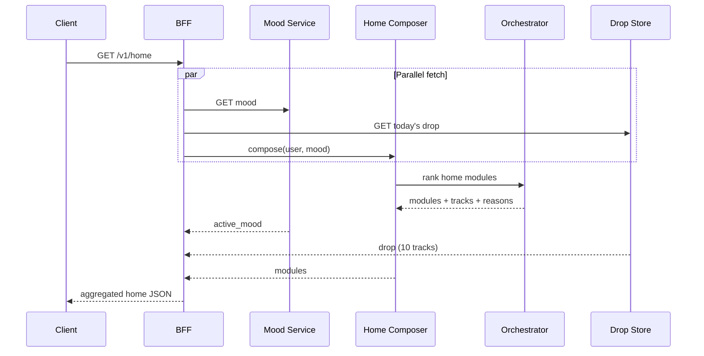
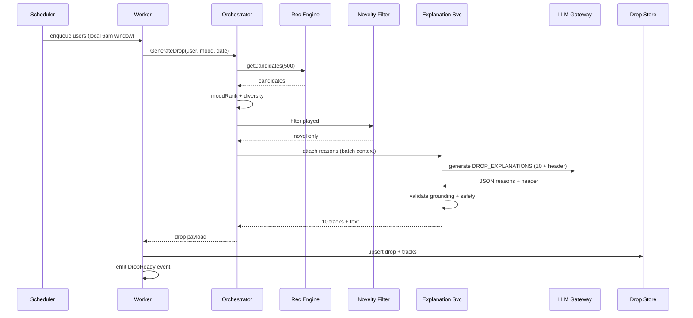
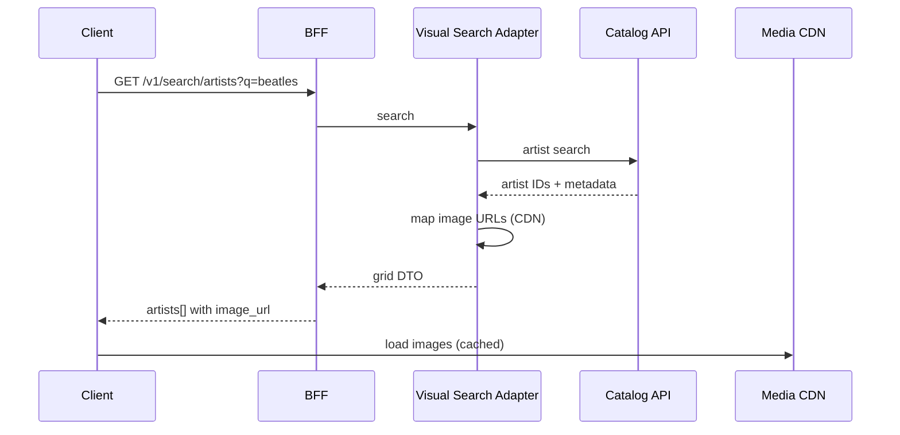

# Mood-First Discovery Gateway — System Architecture

**Document purpose:** Detailed technical architecture for implementation and review.  
**Source:** [`docs/problemstatement.md`](./problemstatement.md)  
**Version:** 1.2  
**Status:** Draft (LLM-enabled; Render + Vercel deployment)

---

## Table of Contents

1. [Architecture Overview](#1-architecture-overview)
2. [Architecture Principles & Constraints](#2-architecture-principles--constraints)
3. [System Context (C4 Level 1)](#3-system-context-c4-level-1)
4. [Container Architecture (C4 Level 2)](#4-container-architecture-c4-level-2)
5. [Service Specifications](#5-service-specifications)
6. [Data Architecture](#6-data-architecture)
7. [API Design](#7-api-design)
8. [Sequence Flows](#8-sequence-flows)
9. [Ranking, ML & LLM Pipeline](#9-ranking-ml--llm-pipeline)
10. [Caching & Performance](#10-caching--performance)
11. [Scheduling & Batch Jobs](#11-scheduling--batch-jobs)
12. [Infrastructure & Deployment](#12-infrastructure--deployment)
13. [Security, Privacy & Compliance](#13-security-privacy--compliance)
14. [Observability & Experimentation](#14-observability--experimentation)
15. [Resilience & Degradation](#15-resilience--degradation)
16. [Phased Rollout Architecture](#16-phased-rollout-architecture)
17. [Architecture Decisions (ADRs)](#17-architecture-decisions-adrs)
18. [Open Questions — Resolved Defaults](#18-open-questions--resolved-defaults)

---

## 1. Architecture Overview

The **Mood-First Discovery Gateway** is a discovery layer that sits **on top of** Spotify's existing recommendation infrastructure. It does not replace collaborative filtering, embeddings, or catalog systems. Instead, it introduces:

- An explicit **mood context** channel
- A **novelty enforcement** layer
- A **daily batch discovery product** (Discovery Drop)
- An **LLM-powered explanation & narrative** layer (with template fallback)
- A **visual-first search/browse** presentation path

### 1.1 High-Level Architecture

```
                                    ┌─────────────────────────┐
                                    │   Spotify Core Platform │
                                    │ (Auth, Playback, Catalog)│
                                    └───────────┬─────────────┘
                                                │
┌──────────────┐   HTTPS    ┌──────────────────▼──────────────────┐
│ Mobile / Web │◀──────────▶│         Discovery Gateway BFF        │
│   Clients    │            │  (Home, Mood, Drop, Search surfaces) │
└──────────────┘            └──────────────────┬──────────────────┘
                                               │
              ┌────────────────────────────────┼────────────────────────────────┐
              │                                │                                │
              ▼                                ▼                                ▼
   ┌────────────────────┐         ┌─────────────────────┐         ┌─────────────────────┐
   │  Mood State Service │         │ Discovery Orchestrator│         │  Home Feed Composer │
   └─────────┬──────────┘         └──────────┬──────────┘         └──────────┬──────────┘
             │                               │                               │
             │              ┌────────────────┼────────────────┐              │
             │              ▼                ▼                ▼              │
             │   ┌─────────────────┐ ┌──────────────┐ ┌─────────────────┐    │
             │   │ Mood-Aware      │ │ Novelty      │ │ Explanation     │    │
             │   │ Ranker          │ │ Filter       │ │ Service         │    │
             │   └────────┬────────┘ └──────┬───────┘ └────────┬────────┘    │
             │            │                 │                  │              │
             │            └────────┬────────┴──────────┬───────┘              │
             │                     ▼                   ▼                      │
             │          ┌─────────────────────┐  ┌─────────────────┐           │
             │          │ Existing Rec Engine │  │  LLM Gateway    │           │
             │          │ + Taste Profile Svc │  │  (inference)    │           │
             │          └─────────────────────┘  └─────────────────┘           │
             │                     │                                           │
             ▼                     ▼                                           ▼
   ┌─────────────────────────────────────────────────────────────────────────────────┐
   │                           Data Layer (stores below)                              │
   └─────────────────────────────────────────────────────────────────────────────────┘
             │                     │                     │                     │
             ▼                     ▼                     ▼                     ▼
      ┌────────────┐      ┌──────────────┐      ┌──────────────┐      ┌──────────────┐
      │ Mood Store │      │ Drop Store   │      │ History /    │      │ Catalog &    │
      │ (Redis +   │      │ (Postgres)   │      │ Novelty      │      │ Media CDN    │
      │  Postgres) │      │              │      │ (existing)   │      │              │
      └────────────┘      └──────────────┘      └──────────────┘      └──────────────┘

   ┌─────────────────────────────────────────────────────────────────────────────────┐
   │  Async: Discovery Drop Generator (scheduler → worker fleet → Drop Store)         │
   └─────────────────────────────────────────────────────────────────────────────────┘
```

### 1.2 Architectural Style

| Aspect | Choice | Rationale |
|--------|--------|-----------|
| **Integration pattern** | Strangler / overlay on existing rec stack | Reuse proven candidate generation; minimize rebuild risk |
| **Service boundaries** | Domain-aligned microservices behind BFF | Independent scaling of mood, drop, explain paths |
| **Sync vs async** | Sync for mood recalibration; async for daily drops | Latency budget for home; batch acceptable overnight |
| **State** | Mood in fast store; drops in durable store | Read-heavy home path; audit trail for drops |
| **Client contract** | BFF aggregates; clients never fan out | Single home payload; fewer round trips |

---

## 2. Architecture Principles & Constraints

### 2.1 Principles

1. **Novelty is a hard gate, not a soft score** — Played tracks never appear in Discovery Drop.
2. **Mood is an additive signal** — Taste profile remains primary; mood re-weights, not replaces.
3. **Explainability is auditable** — Every LLM-generated reason maps to grounded ranking features; prompt + output logged.
4. **Playback never blocks on LLM** — LLM runs async or precomputed; template fallback on timeout/failure.
5. **Precompute where possible, re-rank in real time where required** — Candidate pools cached per user; mood tap only re-scores.
6. **LLM is grounded, not generative-free** — Models receive structured feature context only; cannot invent taste claims.

### 2.2 Non-Functional Requirements

| NFR | Target (v1) |
|-----|-------------|
| Home feed load (p95) | ≤ 800 ms |
| Mood change → feed refresh (p95) | ≤ 1.5 s |
| Discovery Drop read (p95) | ≤ 200 ms (precomputed) |
| Discovery Drop availability | 99.9% by user-local refresh window |
| Artist search grid (p95) | ≤ 500 ms |
| Explanation attach rate | ≥ 99% for drops; ≥ 90% for home modules |
| LLM explanation latency (batch, per drop) | ≤ 3 s for 10 reasons |
| LLM fallback to template rate | ≤ 5% under normal operations |

### 2.3 Scope Boundaries (from product brief)

- Music only (no podcasts/audiobooks in v1)
- Explicit mood selection as primary input; LLM-assisted mood *suggestion* optional in Phase 2
- LLM for explanations, drop narrative, and home copy; templates as fallback
- Reuse existing recommendation engine for candidates

---

## 3. System Context (C4 Level 1)

```
┌─────────────┐         ┌──────────────────────────────────────┐         ┌─────────────────┐
│   Listener  │────────▶│  Mood-First Discovery Gateway System │────────▶│ Playback / Queue│
│  (Mobile/   │         │                                      │         │ (Spotify Core)  │
│   Web)      │◀────────│  Mood · Drop · Explain · Visual Home │◀────────│                 │
└─────────────┘         └──────────────────┬───────────────────┘         └─────────────────┘
                                           │
              ┌────────────────────────────┼────────────────────────────┐
              ▼                            ▼                            ▼
   ┌────────────────────┐      ┌────────────────────┐      ┌────────────────────┐
   │ Recommendation     │      │ Listening History  │      │ Catalog / Metadata │
   │ Engine (existing)  │      │ Service (existing) │      │ + CDN (existing)   │
   └────────────────────┘      └────────────────────┘      └────────────────────┘
              │
              ▼
   ┌────────────────────┐
   │ Experimentation    │
   │ Platform (A/B)     │
   └────────────────────┘
```

### 3.1 External Dependencies

| System | Interaction | Criticality |
|--------|-------------|-------------|
| **Auth / Identity** | JWT validation on all user APIs | Critical |
| **Taste Profile Service** | Genre affinities, embeddings | Critical for ranking |
| **Rec Engine** | Candidate track pools | Critical |
| **Listening History** | Play/skip/save events; novelty checks | Critical |
| **Catalog Service** | Track/artist metadata, URIs | Critical |
| **Media CDN** | Artist images, album art | High (visual search) |
| **Push Notification** | Daily drop ready (Phase 2) | Medium |
| **LLM Gateway** | Grounded text generation (explanations, narratives) | High |
| **Analytics / Metrics** | Event pipeline | High |

---

## 4. Container Architecture (C4 Level 2)

### 4.1 Container Map

| Container | Type | Responsibility |
|-----------|------|----------------|
| **Discovery Gateway BFF** | API service | Auth, aggregation, client-specific DTOs, rate limiting |
| **Mood State Service** | API service | CRUD for user mood; session + persistent preference |
| **Discovery Orchestrator** | API service | Coordinates ranking requests across ranker, novelty, explain |
| **Mood-Aware Ranker** | API / library | Re-score candidates using mood weight vectors |
| **Novelty Filter Service** | API service | Batch + point lookups: has user played track? |
| **Explanation Service** | API service | Orchestrates reason generation; template fallback |
| **LLM Gateway** | API service | Grounded LLM inference; guardrails, caching, token budgeting |
| **Discovery Drop Generator** | Worker + scheduler | Daily per-user drop creation |
| **Home Feed Composer** | API service | Assembles home modules from orchestrator output |
| **Visual Search Adapter** | API service | Artist grid search; CDN URL resolution |
| **Event Ingestion Consumer** | Stream consumer | Updates novelty cache on play events |

### 4.2 Container Interaction Diagram

```
┌─────────────┐
│   Client    │
└──────┬──────┘
       │ GET /v1/home
       ▼
┌─────────────────┐     GET mood      ┌──────────────────┐
│ Discovery BFF   │──────────────────▶│ Mood State Svc   │
└────────┬────────┘                   └──────────────────┘
         │ compose
         ▼
┌─────────────────┐     rank request    ┌──────────────────────┐
│ Home Feed       │──────────────────▶│ Discovery Orchestrator│
│ Composer        │◀──────────────────│                      │
└────────┬────────┘     modules+tracks └──────────┬───────────┘
         │                                         │
         │ get drop                                ├──▶ Mood-Aware Ranker
         ▼                                         ├──▶ Novelty Filter
┌─────────────────┐                                └──▶ Explanation Svc
│ Drop Store      │                                          │
│ (read replica)  │◀─────────────────────────────────────────┘
└─────────────────┘              (drop pre-built with LLM reasons)
                                              Explanation ──▶ LLM Gateway

         Async path (nightly):
┌─────────────────┐     jobs      ┌──────────────────────┐
│ Drop Scheduler  │──────────────▶│ Drop Generator Worker │
└─────────────────┘               └──────────┬───────────┘
                                             │ pipeline
                                             ▼
                                    Orchestrator + Novelty + Explain
                                             │
                                             ▼
                                    Drop Store (write)
```

---

## 5. Service Specifications

### 5.1 Discovery Gateway BFF

**Role:** Single entry point for discovery surfaces. Shields clients from internal service topology.

| Concern | Implementation |
|---------|----------------|
| Auth | Validate OAuth2/JWT; propagate `user_id` |
| Aggregation | Parallel fetch: mood + home composition + drop |
| Versioning | `/v1` namespace; feature flags per experiment cohort |
| Rate limit | Per-user: 60 req/min home; 10 mood changes/min |

**Key behaviors:**

- `GET /v1/home` → parallel calls to Mood State, Home Feed Composer, Discovery Drop read
- `PUT /v1/users/me/mood` → write mood, then trigger partial home refresh response
- Normalizes track DTOs: `track_id`, `uri`, `title`, `artists[]`, `image_url`, `reason_text`, `reason_feature_id`, `reason_method`

---

### 5.2 Mood State Service

**Role:** Source of truth for explicit user mood selection.

#### Data model

```json
{
  "user_id": "uuid",
  "active_mood": "ADVENTUROUS",
  "source": "USER_TAP",
  "updated_at": "2026-07-01T08:12:00Z",
  "persist": true,
  "session_id": "optional-session-uuid"
}
```

#### Mood enum

**Product / UI (user selection):**  
`ENERGISED | FOCUSED | LOW_KEY | ADVENTUROUS | NOSTALGIC | SAD`

**Dataset catalog tagging (§6.5):**  
`ENERGISED | FOCUSED | LOW_KEY | NOSTALGIC | SAD` — **`ADVENTUROUS` is excluded** from dataset mood assignment. Tracks are not bucketed as Adventurous in the seed catalog; at runtime, Adventurous selections use the ranker's `novelty_score` and genre-stretch signals instead of pre-tagged catalog moods.

#### Storage strategy

| Store | Data | TTL |
|-------|------|-----|
| **Redis** | `mood:{user_id}` → active mood | No TTL if `persist=true`; else session TTL 24h |
| **Postgres** | `user_mood_preferences` history | Permanent (analytics, personalization v3) |

#### APIs

| Method | Path | Description |
|--------|------|-------------|
| `GET` | `/internal/users/{user_id}/mood` | Current mood (default `LOW_KEY` if unset) |
| `PUT` | `/internal/users/{user_id}/mood` | Set mood; emit `MoodChanged` event |

---

### 5.3 Discovery Orchestrator

**Role:** Central coordinator for all discovery ranking workflows.

#### Operations

| Operation | Trigger | Output |
|-----------|---------|--------|
| `GenerateDrop` | Batch worker | 10 tracks + features + reasons |
| `RerankHomeModules` | Mood change / home load | Ordered modules with tracks |
| `GetCandidates` | Internal | Raw candidate pool (cached) |

#### Orchestration pipeline (pseudocode)

```
function generateDiscoveryDrop(userId, mood, date):
    candidates = recEngine.getAdjacentCandidates(userId, limit=500)
    scored = moodRanker.score(candidates, mood)
  filtered = noveltyFilter.excludePlayed(userId, scored)
  diversified = diversityEngine.select(filtered, count=10, rules=DROP_RULES)
    explained = explanationService.attach(diversified, mood)
    return persistDrop(userId, date, explained)
```

#### Dependencies & timeouts

| Dependency | Timeout | Fallback |
|------------|---------|----------|
| Rec Engine | 300 ms | Cached candidate pool (6h stale OK for drop batch) |
| Mood Ranker | 100 ms | Pass-through scores |
| Novelty Filter | 150 ms | Exclude uncertain → safe |
| Explanation + LLM | 3 s (batch only) | Template fallback; never block read path |

---

### 5.4 Mood-Aware Ranker

**Role:** Apply mood-specific weight vectors to candidate feature vectors.

#### Input features per track

**Runtime ranker (production scoring):**

- `energy`, `valence`, `tempo`, `instrumentalness` (audio analysis)
- `genre_ids[]`
- `novelty_score` (from rec engine)

**Dataset catalog tagging** uses **numeric audio features only** — see [§6.5 Dataset Mood Assignment](#65-dataset-mood-assignment). No genre, era, or extra fields (e.g. `acousticness`, `speechiness`) are used for mood bucketing in the seed dataset.

#### Scoring formula (v1)

```
final_score = base_rec_score
            + dot(mood_weight_vector, normalized_audio_features)
            + genre_affinity_bonus(user_taste, track_genres)
            + mood_specific_bonus(mood, track)
```

#### Mood weight vectors (config-driven)

Stored in config service / YAML; hot-reloaded for experiments.

```yaml
moods:
  ENERGISED:
    energy: 0.35
    valence: 0.25
    tempo: 0.30
    novelty: 0.10
  FOCUSED:
    energy: -0.20
    tempo: -0.15
    instrumentalness: 0.40
    novelty: 0.05
  LOW_KEY:
    energy: -0.30
    valence: 0.10
    tempo: -0.25
  NOSTALGIC:
    energy: 0.10
    valence: 0.20
    tempo: 0.05
  SAD:
    energy: -0.35
    valence: -0.40
    tempo: -0.20
  # ADVENTUROUS: product/UI mood only — excluded from dataset mood tagging (§6.5)
```

---

### 5.5 Novelty Filter Service

**Role:** Enforce "never heard before" constraint.

#### Interface

```
POST /internal/novelty/filter
Body: { user_id, track_ids: string[] }
Response: { novel_track_ids: string[], excluded: [{ track_id, reason }] }
```

#### Storage

| Layer | Purpose |
|-------|---------|
| **Bloom filter per user** (Redis) | Fast negative lookup; rebuilt nightly |
| **Played track set** (existing history service) | Source of truth on bloom collision |
| **Recent drop history** (Postgres) | Dedup vs last 7 days of drops |

#### Rules

1. If `played_count > 0` → exclude (hard).
2. If in last 7 drops → exclude (configurable).
3. On bloom false positive → user report "heard before" → add to exclude + metrics.

---

### 5.6 Explanation Service

**Role:** Generate human-readable one-line recommendation reasons using **grounded LLM inference**, with deterministic template fallback.

#### Architecture pattern: Grounded generation

The Explanation Service does **not** let the LLM freely invent why a track was picked. It passes **structured ranking evidence** as context; the LLM's job is to render that evidence as natural, varied, trust-building copy.

```
Ranking features (structured)  →  Explanation Service  →  LLM Gateway  →  Validated one-liner
                                        ↓ (on failure)
                                 Template fallback
```

#### LLM use cases

| Use case | When | Output |
|----------|------|--------|
| **Track reason** | Drop batch + home module compose | One line per track (~60 chars) |
| **Drop narrative** | Drop batch | Header: e.g. "10 fresh picks for your Adventurous morning" |
| **Module intro** | Home compose | Short module subtitle (optional, Phase 2) |
| **Mood suggestion copy** | App open (Phase 2) | "Feeling focused? Try Focused mode" |

#### Input payload (per track)

```json
{
  "track_id": "spotify:track:xxx",
  "track_name": "Motion",
  "artist_name": "Khruangbin",
  "active_mood": "ADVENTUROUS",
  "primary_feature": {
    "feature_id": "TASTE_ARTIST",
    "payload": { "artist_name": "Khruangbin", "affinity_score": 0.87 }
  },
  "secondary_features": [
    { "feature_id": "MOOD_MATCH", "payload": { "mood": "ADVENTUROUS" } },
    { "feature_id": "GENRE_TREND", "payload": { "genre": "psychedelic soul" } }
  ],
  "constraints": { "max_chars": 60, "tone": "warm, concise, second-person" }
}
```

#### LLM prompt strategy (batch for Discovery Drop)

Single batched call generates all 10 track reasons + drop header to minimize latency and cost:

```
System: You write one-line Spotify discovery explanations. Use ONLY the provided
        features. Max 60 characters per track. No hashtags. No questions.

User:   Mood: ADVENTUROUS
        Drop header needed.
        Track 1: {structured context}
        Track 2: {structured context}
        ...
        Return JSON: { "header": "...", "reasons": ["...", ...] }
```

#### Validation pipeline (post-LLM)

1. **Length check** — truncate or reject if > 60 chars
2. **Grounding check** — reason must reference at least one provided `feature_id` entity (artist, genre, mood)
3. **Content safety filter** — block profanity, PII, off-brand tone
4. **Hallucination guard** — reject if mentions artist/genre not in context
5. On any failure → **template fallback** for that slot

#### Template fallback registry

| `feature_id` | Template | Example |
|--------------|----------|---------|
| `TASTE_ARTIST` | `Because you love {artist}` | Because you love Khruangbin |
| `TASTE_GENRE` | `Because you love {genre}` | Because you love indie rock |
| `MOOD_MATCH` | `Matches your {mood} vibe` | Matches your Adventurous vibe |
| `GENRE_TREND` | `Trending in {genre} this week` | Trending in jazz fusion this week |
| `COLLAB_SIM` | `Fans of {artist} are listening to this` | Fans of Bon Iver are listening to this |
| `NEW_RELEASE` | `New release near your taste` | New release near your taste |

#### Audit record

```json
{
  "recommendation_id": "uuid",
  "user_id": "uuid",
  "track_id": "uuid",
  "feature_id": "TASTE_ARTIST",
  "feature_payload": { "artist_id": "...", "artist_name": "..." },
  "rendered_text": "A bold pick for fans of Khruangbin",
  "generation_method": "LLM",
  "model_id": "groq/llama-3.1-8b-instant",
  "prompt_hash": "sha256:abc...",
  "grounding_passed": true,
  "created_at": "ISO8601"
}
```

Retained 90 days for compliance, debugging, and trust audits.

---

### 5.10 LLM Gateway Service

**Role:** Centralized, guarded interface to LLM providers. All discovery LLM calls route through this service.

#### Responsibilities

| Concern | Implementation |
|---------|----------------|
| **Provider abstraction** | Groq-first provider wrapper; swappable via config |
| **Prompt templates** | Versioned prompts in config store; A/B testable |
| **Token budgeting** | Per-request max tokens; per-user daily cap |
| **Caching** | Cache by `(prompt_hash, model_id)` — 24h TTL for identical contexts |
| **Rate limiting** | Global + per-tenant queues; priority queue for batch jobs |
| **Guardrails** | Output validation, content filter, grounding check |
| **Observability** | Log latency, tokens, model version, fallback reason |

#### API

```
POST /internal/llm/generate
Body: {
  "task": "DROP_EXPLANATIONS" | "TRACK_REASON" | "DROP_HEADER" | "MOOD_SUGGESTION",
  "model": "groq/llama-3.1-8b-instant",
  "context": { ... structured grounding payload ... },
  "response_format": "json"
}
Response: {
  "text": "...",
  "model_id": "groq/llama-3.1-8b-instant",
  "tokens_used": 142,
  "latency_ms": 890,
  "cached": false
}
```

#### Model selection

| Task | Model | Rationale |
|------|-------|-----------|
| Drop batch (10 reasons + header) | `llama-3.1-8b-instant` on Groq | Low-latency structured JSON output |
| Real-time home module reasons | Cached LLM output or template | Avoid sync LLM on critical path |
| Mood suggestion (Phase 2) | `llama-3.1-8b-instant` on Groq | Low stakes; async on app open |

#### Groq provider configuration

The LLM Gateway is configured to call **Groq** using an OpenAI-compatible API surface.

| Env var | Purpose |
|---------|---------|
| `LLM_PROVIDER` | Provider selector; set to `groq` |
| `GROQ_API_KEY` | API key for Groq requests |
| `GROQ_MODEL` | Default model slug, e.g. `llama-3.1-8b-instant` |
| `GROQ_BASE_URL` | Base URL for Groq's OpenAI-compatible endpoint |

For MVP, all explanation and drop-header generation should default to the Groq model configured by `GROQ_MODEL`.

#### Deployment

- Dedicated deployment with **no public ingress** (internal only)
- Autoscale on queue depth for batch windows (5–7 AM local peaks)
- Circuit breaker: 3 consecutive provider failures → template-only mode for 5 min

---

### 5.7 Discovery Drop Generator

**Role:** Batch-create daily drops per active user.

#### Scheduler

- **Trigger:** Cron every 15 min; selects users whose local time ∈ `[refresh_hour, refresh_hour + 15min)`
- **Default refresh:** 06:00 user-local
- **Sharding:** `hash(user_id) % num_partitions` → worker queue

#### Worker pipeline

```
1. Load user mood (or default LOW_KEY)
2. Load taste profile
3. Call Orchestrator.GenerateDrop
4. Validate: exactly 10 novel tracks
5. If < 10 after filter → expand adjacent genre radius (max 2 retries)
6. Persist drop; emit DropReady event
7. (Phase 2) Trigger push notification with LLM-generated drop header
```

#### Idempotency

- Unique key: `(user_id, drop_date)` — replays overwrite same row
- Failed jobs → DLQ with exponential backoff

---

### 5.8 Home Feed Composer

**Role:** Build ordered home modules for client rendering.

#### Module types (v1)

| Module ID | Content | Mood-sensitive |
|-----------|---------|----------------|
| `mood_gateway` | UI config + active mood | Display only |
| `discovery_drop` | 10 tracks + LLM reasons + header | Re-filter display order by mood |
| `fresh_picks` | 20 tracks carousel | Yes |
| `mood_mix` | 1 playable mix | Yes |
| `artist_grid` | 12 artist tiles | Partial (genre affinity) |

#### Composition rules

1. Always pin `mood_gateway` first, `discovery_drop` second.
2. Remaining modules ranked by engagement model + mood score.
3. Cap home payload: ≤ 50 tracks total for initial paint.

---

### 5.9 Visual Search Adapter

**Role:** Artist-first search with CDN image resolution.

#### Flow

```
GET /v1/search/artists?q=radiohead
  → Catalog search (artist intent)
  → Resolve primary image URI per artist
  → Return grid DTO: { artists: [{ id, name, image_url, uri }] }
```

#### CDN

- Image sizes: 160×160 (grid), 320×320 (retina)
- Cache-Control: `public, max-age=86400`
- BFF adds signed URL or passes through catalog CDN URL

---

## 6. Data Architecture

### 6.1 Entity Relationship (Discovery Domain)

```
┌─────────────────┐       ┌─────────────────┐
│ user_mood_      │       │ discovery_drop  │
│ preferences     │       │                 │
├─────────────────┤       ├─────────────────┤
│ user_id (PK)    │       │ drop_id (PK)    │
│ active_mood     │       │ user_id (FK)    │
│ persist         │       │ drop_date       │
│ updated_at      │       │ mood_at_gen     │
└─────────────────┘       │ drop_header     │
                          │ header_method   │
                          │ status          │
                          │ created_at      │
                          └────────┬────────┘
                                   │ 1:N
                          ┌────────▼────────┐
                          │ drop_track      │
                          ├─────────────────┤
                          │ drop_id (FK)    │
                          │ position (1-10) │
                          │ track_id        │
                          │ reason_text     │
                          │ reason_feature  │
                          │ reason_method   │
                          │ rec_score       │
                          └─────────────────┘

┌─────────────────┐
│ track_mood_tags │  ← dataset mood bucketing (§6.5)
├─────────────────┤
│ track_id (PK)   │
│ primary_mood    │  ENERGISED|FOCUSED|LOW_KEY|NOSTALGIC|SAD
│ mood_tags[]     │
│ energy..instr.  │  snapshot at tag time
└─────────────────┘

┌─────────────────┐       ┌─────────────────┐
│ explanation_    │       │ user_played_    │
│ audit_log       │       │ bloom (Redis)   │
├─────────────────┤       └─────────────────┘
│ recommendation_id│
│ user_id         │
│ track_id        │
│ feature_id      │
│ rendered_text   │
│ generation_method│  ← LLM | TEMPLATE
│ model_id        │
│ prompt_hash     │
└─────────────────┘
```

### 6.2 Core Tables (Postgres)

#### `discovery_drop`

| Column | Type | Notes |
|--------|------|-------|
| `drop_id` | UUID PK | |
| `user_id` | UUID FK | Indexed |
| `drop_date` | DATE | Unique with user_id |
| `mood_at_generation` | VARCHAR | Enum |
| `drop_header` | VARCHAR(120) | LLM-generated narrative |
| `header_method` | VARCHAR | `LLM` or `TEMPLATE` |
| `track_count` | SMALLINT | Always 10 on success |
| `status` | VARCHAR | `READY`, `PARTIAL`, `FAILED` |
| `created_at` | TIMESTAMPTZ | |

#### `drop_track`

| Column | Type | Notes |
|--------|------|-------|
| `drop_id` | UUID FK | |
| `position` | SMALLINT | 1–10 |
| `track_id` | VARCHAR | Spotify URI/ID |
| `reason_text` | VARCHAR(80) | |
| `reason_feature_id` | VARCHAR | |
| `reason_method` | VARCHAR | `LLM` or `TEMPLATE` |
| `base_score` | FLOAT | Audit |

#### `user_mood_preferences`

| Column | Type | Notes |
|--------|------|-------|
| `user_id` | UUID PK | |
| `active_mood` | VARCHAR | |
| `persist` | BOOLEAN | |
| `updated_at` | TIMESTAMPTZ | |

### 6.3 Redis Keys

| Key pattern | Value | TTL |
|-------------|-------|-----|
| `mood:{user_id}` | mood enum string | None or 24h |
| `candidates:{user_id}` | serialized candidate list | 6h |
| `home:{user_id}:{mood}` | serialized home modules | 15 min |
| `bloom:played:{user_id}` | bloom filter bytes | 24h (rebuilt nightly) |
| `drop:ready:{user_id}:{date}` | drop_id | 48h |
| `llm:cache:{prompt_hash}` | generated text | 24h |

### 6.4 Events (Kafka / Pub-Sub)

| Event | Producer | Consumers |
|-------|----------|-----------|
| `MoodChanged` | Mood State Svc | Analytics, Home cache invalidation |
| `DiscoveryDropReady` | Drop Generator | Push svc (P2), Analytics |
| `TrackPlayed` | Core playback | Novelty bloom updater |
| `HeardBeforeReported` | BFF | Novelty correction, Analytics |
| `RecommendationServed` | Orchestrator | Explanation audit, Metrics |
| `LLMGenerationCompleted` | LLM Gateway | Cost tracking, quality monitoring |

### 6.5 Dataset Mood Assignment

Catalog tracks in the **golden seed dataset** are tagged with one or more moods using **numeric audio features only**. This logic is used by `build_mood_buckets.py` (or equivalent) at seed time and is the same in dev, staging, and production catalog ETL.

#### Scope

| In scope | Out of scope |
|----------|--------------|
| `energy`, `valence`, `tempo`, `instrumentalness` | `acousticness`, `speechiness`, `danceability`, `liveness`, `loudness` |
| 5 dataset moods (see table below) | **`ADVENTUROUS`** — not assigned in dataset |
| Threshold rules per mood | Genre tags, era/decade, user taste |

A column marked **—** (dash) means **no threshold is applied** for that feature when testing that mood. The feature is ignored for bucketing, not required to be null.

#### Bucketing thresholds (numeric only)

All values are normalized Spotify-style floats in `[0, 1]` except `tempo` (BPM).

| Mood | energy | valence | tempo (BPM) | instrumentalness |
|------|--------|---------|-------------|-------------------|
| **ENERGISED** | > 0.7 | > 0.6 | > 120 | — |
| **FOCUSED** | 0.3 – 0.6 | 0.4 – 0.6 | 80 – 110 | > 0.5 |
| **LOW_KEY** | < 0.4 | 0.3 – 0.6 | < 100 | — |
| **NOSTALGIC** | 0.3 – 0.6 | 0.4 – 0.7 | — | — |
| **SAD** | < 0.35 | < 0.35 | < 100 | — |

**Excluded from dataset moods:** `ADVENTUROUS` — not computed from catalog audio features in v1 dataset pipeline.

#### Assignment algorithm

```
function mood_matches(track, mood):
    for each feature in [energy, valence, tempo, instrumentalness]:
        if mood.threshold[feature] is "—":
            continue                          # skip; no constraint
        if not track[feature] satisfies mood.threshold[feature]:
            return false
    return true

function assign_dataset_moods(track):
    eligible = [m for m in DATASET_MOODS if mood_matches(track, m)]
    if eligible is empty:
        return { primary_mood: null, mood_tags: [] }
    # Tie-break: mood with most active (non-"—") constraints satisfied;
    # then priority: ENERGISED > FOCUSED > LOW_KEY > NOSTALGIC > SAD
    primary = tie_break(eligible)
    return { primary_mood: primary, mood_tags: eligible }
```

**Rules:**

1. A track **matches** a mood only when **every non-"—" threshold** for that mood is satisfied.
2. A track may match **multiple** moods; all matches are stored in `mood_tags[]`.
3. `primary_mood` is the single best match for indexing and coverage reports.
4. Tracks matching **no** mood are valid — they remain in the catalog but are not mood-tagged (still rankable at runtime via the Mood-Aware Ranker).

#### Catalog table extension

#### `track_mood_tags` (seed / catalog)

| Column | Type | Notes |
|--------|------|-------|
| `track_id` | VARCHAR PK | FK to catalog |
| `primary_mood` | VARCHAR | One of 5 dataset moods, or `NULL` |
| `mood_tags` | VARCHAR[] | All matching moods |
| `energy` | FLOAT | Snapshot used at tag time |
| `valence` | FLOAT | |
| `tempo` | FLOAT | BPM |
| `instrumentalness` | FLOAT | |
| `tagged_at` | TIMESTAMPTZ | |
| `dataset_version` | VARCHAR | e.g. `v1.0.0` |

#### Coverage validation (CI / seed script)

```bash
python scripts/validate_coverage.py
```

| Check | Target |
|-------|--------|
| Tracks with mood tags | ≥ 1,000 (or 80% of seed catalog) |
| Per dataset mood (`ENERGISED` … `SAD`) | ≥ 200 tracks each |
| `ADVENTUROUS` in `track_mood_tags` | **0 rows** (must not appear) |
| Features used in tagging | Only `energy`, `valence`, `tempo`, `instrumentalness` |

#### Dev vs production

| Environment | Source | Mood logic | Hosting |
|-------------|--------|------------|---------|
| **Dev / local** | CSV seed or demo catalog | §6.5 thresholds | `scripts/run_dev.py` → `:8010` |
| **Staging** | Subset of prod catalog ETL | Same §6.5 thresholds | Optional Render preview |
| **Production** | `Music_Data.csv` seeded into Postgres (once) | Same §6.5 thresholds | Render Postgres; API on Render |

The **same bucketing rules and `dataset_version`** must be used in all environments so mood-tagged catalog behavior is identical; only catalog size differs. The API **never reads CSV at request time** in production.

---

## 7. API Design

### 7.1 Public API (BFF)

#### `GET /v1/home`

**Response:**

```json
{
  "active_mood": "ADVENTUROUS",
  "mood_options": ["ENERGISED", "FOCUSED", "LOW_KEY", "ADVENTUROUS", "NOSTALGIC", "SAD"],
  "modules": [
    {
      "type": "mood_gateway",
      "data": { "active_mood": "ADVENTUROUS" }
    },
    {
      "type": "discovery_drop",
      "data": {
        "drop_id": "uuid",
        "header": "10 fresh picks for your Adventurous morning",
        "header_method": "LLM",
        "refresh_at": "2026-07-02T06:00:00-05:00",
        "tracks": [
          {
            "track_id": "spotify:track:xxx",
            "name": "Track Name",
            "artists": [{ "id": "...", "name": "Artist" }],
            "image_url": "https://...",
            "reason": "A bold stretch from your love of indie rock",
            "reason_feature_id": "TASTE_GENRE",
            "reason_method": "LLM"
          }
        ]
      }
    },
    {
      "type": "fresh_picks",
      "data": { "tracks": [] }
    }
  ]
}
```

#### `PUT /v1/users/me/mood`

**Request:**

```json
{
  "mood": "FOCUSED",
  "persist": true
}
```

**Response:** `200` with updated mood + optional `home_delta` for partial client refresh.

#### `GET /v1/discovery-drop`

Returns today's drop; `404` with `next_refresh_at` if not yet generated.

#### `GET /v1/search/artists?q={query}&limit=20`

**Response:**

```json
{
  "artists": [
    {
      "id": "spotify:artist:xxx",
      "name": "Radiohead",
      "image_url": "https://i.scdn.co/image/...",
      "uri": "spotify:artist:xxx"
    }
  ],
  "layout": "grid"
}
```

#### `POST /v1/discovery-drop/tracks/{track_id}/heard-before`

User feedback when novelty filter false negative.

---

### 7.2 Internal API Summary

| Service | Endpoint | Method |
|---------|----------|--------|
| Mood State | `/internal/users/{id}/mood` | GET, PUT |
| Orchestrator | `/internal/rank/home` | POST |
| Orchestrator | `/internal/rank/drop` | POST |
| Novelty | `/internal/novelty/filter` | POST |
| Novelty | `/internal/novelty/check` | POST |
| Explanation | `/internal/explain` | POST |
| LLM Gateway | `/internal/llm/generate` | POST |
| Composer | `/internal/home/compose` | POST |

---

## 8. Sequence Flows

### 8.1 App Open — Home Load



### 8.2 Mood Tap — Real-Time Recalibration

```mermaid
sequenceDiagram
    participant C as Client
    participant B as BFF
    participant M as Mood Service
    participant H as Home Composer
    participant R as Redis Cache

    C->>B: PUT /v1/users/me/mood {ADVENTUROUS}
    B->>M: persist mood
    M-->>B: OK
    B->>R: invalidate home:{user}:{old_mood}
    B->>H: compose(user, ADVENTUROUS)
    Note over H: Uses cached candidates;<br/>re-score only (~100ms)
    H-->>B: updated modules
    B-->>C: mood + home_delta
    C->>C: Patch UI modules in place
```

### 8.3 Nightly Discovery Drop Generation



### 8.4 Artist Visual Search



---

## 9. Ranking, ML & LLM Pipeline

### 9.1 AI/LLM Utilization Summary

```
┌────────────────────────────────────────────────────────────────────────┐
│ EXISTING ML (reused)                                                    │
│ Rec Engine · Taste Embeddings · Audio Features · Discover Weekly       │
└───────────────────────────────┬────────────────────────────────────────┘
                                ▼
┌────────────────────────────────────────────────────────────────────────┐
│ MOOD-AWARE RANKER (config-driven re-scoring on ML candidates)         │
└───────────────────────────────┬────────────────────────────────────────┘
                                ▼
┌────────────────────────────────────────────────────────────────────────┐
│ LLM LAYER (grounded generation — batch & async only on critical paths)  │
│ • Track explanations (batched, 10 per drop)                             │
│ • Drop header narrative                                                 │
│ • Home module copy (Phase 2)                                            │
│ • Mood suggestion copy (Phase 2)                                        │
└───────────────────────────────┬────────────────────────────────────────┘
                                ▼
┌────────────────────────────────────────────────────────────────────────┐
│ TEMPLATE FALLBACK (deterministic, always available)                     │
└────────────────────────────────────────────────────────────────────────┘
```

| Layer | Technology | Role |
|-------|------------|------|
| Candidate generation | Existing rec ML | Who to recommend |
| Mood re-ranking | Feature-weighted scoring | What fits mood right now |
| Novelty filter | Rules + bloom filter | Exclude heard tracks |
| **LLM Gateway** | **Groq-hosted Llama model** | **Natural language explanations** |
| Template fallback | Deterministic strings | Reliability + audit baseline |

### 9.2 Discovery Drop Pipeline (Batch)

```
┌──────────────┐    ┌──────────────┐    ┌──────────────┐    ┌──────────────┐
│ Candidate    │───▶│ Mood         │───▶│ Novelty      │───▶│ Diversity    │
│ Generation   │    │ Re-rank      │    │ Hard Filter  │    │ Selector     │
│ (rec engine) │    │              │    │              │    │ (top 10)     │
└──────────────┘    └──────────────┘    └──────────────┘    └──────┬───────┘
                                                                     │
                                                                     ▼
                                                              ┌──────────────┐
                                                              │ Explanation  │
                                                              │ + LLM Gateway│
                                                              │ + Persist    │
                                                              └──────────────┘
```

**Diversity rules (DROP_RULES):**

- Max 2 tracks per artist
- Min 4 distinct genres in drop
- No duplicate album
- Penalize tracks in prior 7 drops

### 9.3 Home Real-Time Re-Rank

- **Input:** Cached 500 candidates per user (refreshed every 6h)
- **On mood change:** Re-score all candidates (~50ms); re-select module contents
- **No full rec engine call** on critical path
- **LLM on home path:** Reasons are **pre-generated** during candidate prewarm or use template fallback — never sync LLM on mood tap

### 9.4 LLM Execution Paths

| Path | LLM? | Pattern |
|------|------|---------|
| Discovery Drop generation (nightly) | Yes | Single batched call per user drop |
| Home load (sync) | No | Read precomputed drop + cached reasons |
| Mood tap (sync) | No | Re-rank only; reasons from cache or template |
| Home module compose (async prewarm) | Yes (optional) | Background job fills `llm:cache` keys |
| Push notification copy (Phase 2) | Yes | Generated with drop; stored in Drop Store |

### 9.5 Integration with Discover Weekly

| Phase | Strategy |
|-------|----------|
| MVP | Separate pools; Drop uses adjacent-genre candidates from same rec engine |
| Phase 2 | Merge candidate pools; deduplicate across DW and Drop |
| Phase 3 | Unified "novelty budget" per week across surfaces |

---

## 10. Caching & Performance

### 10.1 Cache Hierarchy

```
Client local cache (home snapshot, 5 min)
        ↓
CDN (artist images)
        ↓
BFF edge cache (optional, mood-keyed, 60s)
        ↓
Redis (candidates, home modules, mood)
        ↓
Postgres read replicas (drops)
        ↓
Origin services
```

### 10.2 Cache Invalidation

| Event | Invalidation |
|-------|--------------|
| Mood change | `home:{user}:*`, compose fresh |
| New play event | Async bloom update; no home invalidation |
| Drop ready | `drop:ready:{user}:{date}` |
| Taste profile major update | `candidates:{user}` |

### 10.3 Performance Budget (Home Load)

| Step | Budget |
|------|--------|
| Auth | 20 ms |
| Mood read (Redis) | 5 ms |
| Drop read (Redis/Postgres) | 30 ms |
| Home compose (cached candidates) | 400 ms |
| Explanation (pre-attached in drop; LLM batch offline) | 0 ms on read path |
| Serialization + network | 100 ms |
| **Total p95 target** | **≤ 800 ms** |

---

## 11. Scheduling & Batch Jobs

### 11.1 Job Catalog

| Job | Schedule | Scale |
|-----|----------|-------|
| `drop-generator` | Every 15 min | Horizontally sharded workers |
| `bloom-rebuild` | Nightly 02:00 UTC per region | Per active user partition |
| `candidate-prewarm` | Every 6h | Top 10M DAU users |
| `llm-prewarm-reasons` | Every 6h | Top 10M DAU users; async LLM for home modules |
| `explanation-audit-archive` | Weekly | Cold storage |

### 11.2 Drop Generation SLA

- **Target:** 95% of users have `READY` drop within 5 min of local refresh time
- **Catch-up:** Users opening app before drop ready see skeleton UI + "Preparing your drop…"
- **Fallback:** Serve Discover Weekly novel subset (filtered) if batch fails 2×

### 11.3 Worker Architecture

```
Scheduler (Kubernetes CronJob)
    → SQS / Kafka topic: drop-jobs-{partition}
        → Worker Deployment (autoscaled on queue depth)
            → Idempotent write to Drop Store
```

---

## 12. Infrastructure & Deployment

### 12.1 Recommended Stack (Reference)

**Spotify-scale reference (design target):**

| Layer | Technology | Notes |
|-------|------------|-------|
| **Compute** | Kubernetes (EKS/GKE) | Existing Spotify k8s likely |
| **BFF + Services** | Go or Java (gRPC internal, REST external) | Match org standard |
| **Batch workers** | Python or Go | ML-friendly Python for ranker experiments |
| **Primary DB** | PostgreSQL | Drops, audit, mood history |
| **Cache** | Redis Cluster | Mood, home, bloom |
| **Queue** | Kafka | Events + drop job queue |
| **Object/CDN** | Existing media CDN | Artist images |
| **Config** | Feature flag + config service | Mood weights, prompts, model routing |
| **Secrets** | Vault / cloud SM | API keys, LLM provider credentials |
| **LLM Provider** | Groq | Grounded text generation |

**Grad project deployment (this repository):**

| Layer | Platform | Artifact / path |
|-------|----------|-----------------|
| **Backend API (Phase 3 BFF)** | [Render](https://render.com) Web Service | `phases/phase-3` FastAPI app |
| **Frontend (mobile web UI)** | [Vercel](https://vercel.com) *(planned)* | `phases/phase-3/static/` (Stitch UI) |
| **PostgreSQL** | Render Managed Postgres | Catalog, drops, mood prefs |
| **Redis** | Render Key Value | Home edge cache, prewarm |
| **Batch / cron** | Render Cron Jobs | Drop generator, LLM prewarm, candidate prewarm |
| **Catalog seed (one-time)** | Developer laptop | `scripts/seed_all.py` → external `DATABASE_URL` |
| **LLM** | Groq API | `GROQ_API_KEY` on Render services |
| **IaC** | `render.yaml` Blueprint | Optional one-click stack |

See [`docs/production-runbook.md`](./production-runbook.md) for step-by-step Render setup and [`docs/phasewiseimplementation.md`](./phasewiseimplementation.md) §7.4 for phase-by-phase rollout.

### 12.2 Deployment Topology

**Reference (Spotify-scale):**

```
Region: us-east-1 (example)
├── discovery-bff (3+ pods, HPA on CPU/RPS)
├── mood-service (2+ pods)
├── orchestrator (3+ pods, CPU-heavy)
├── explanation-service (2+ pods)
├── llm-gateway (2+ pods, HPA on queue depth; rate-limited)
├── home-composer (3+ pods)
├── novelty-filter (2+ pods, memory for bloom)
├── drop-worker (HPA on queue lag, 0→N)
└── postgres (RDS multi-AZ) + redis cluster
```

**Grad project (Render + Vercel):**

```
┌─────────────────────────────────────────────────────────────────────────┐
│                         PRODUCTION (grad project)                        │
├─────────────────────────────────────────────────────────────────────────┤
│  Vercel (planned)              Render                                     │
│  ┌──────────────────┐          ┌──────────────────────────────────────┐  │
│  │ Mobile web UI    │  HTTPS   │ moodai-api (Web Service)             │  │
│  │ index.html       │ ───────▶ │ Phase 3 FastAPI BFF + /v1/* APIs     │  │
│  │ app.js (Stitch)  │  CORS    │ GET / serves UI until Vercel cutover │  │
│  └──────────────────┘          └───────────────┬──────────────────────┘  │
│         ▲                                     │                           │
│         │ VITE_/NEXT_PUBLIC_API_URL           │ internal                  │
│         │ = https://moodai-api.onrender.com   ▼                           │
│                                 ┌──────────────┐  ┌──────────────┐       │
│                                 │ moodai-db    │  │ moodai-redis │       │
│                                 │ (Postgres)   │  │ (Key Value)  │       │
│                                 └──────────────┘  └──────────────┘       │
│                                 ┌──────────────────────────────────┐     │
│                                 │ Cron: daily-drop, llm-prewarm,    │     │
│                                 │       candidate-prewarm            │     │
│                                 └──────────────────────────────────┘     │
└─────────────────────────────────────────────────────────────────────────┘

Developer laptop (one-time / on change):
  Music_Data.csv ──seed──▶ Render Postgres (external DATABASE_URL)
  scripts/apply_schemas.py
  scripts/seed_all.py
```

**Current state (interim):** The Stitch mobile UI is **co-hosted** on Render (`GET /` + `/assets/*` from the same web service). **Target state:** UI on Vercel, API-only on Render; frontend calls Render via public API base URL.

### 12.3 Render backend — service catalog

Defined in root [`render.yaml`](../render.yaml). Manual setup uses the same commands.

| Render resource | Name | Role |
|-----------------|------|------|
| PostgreSQL | `moodai-db` | Runtime catalog (`tracks`, `track_mood_tags`, `play_history`, drops) |
| Key Value | `moodai-redis` | Edge cache + prewarm |
| Web Service | `moodai-api` | Phase 3 BFF, health check `/healthz` |
| Cron Job | `moodai-daily-drop` | `0 6 * * *` UTC — discovery drops |
| Cron Job | `moodai-llm-prewarm` | Every 6h — LLM reason cache |
| Cron Job | `moodai-candidate-prewarm` | Every 6h (+30m) — candidate pools |

**Web service commands (repo root):**

| Setting | Value |
|---------|--------|
| **Build** | `pip install --upgrade pip && pip install -r requirements-prod.txt` |
| **Start** | `bash scripts/render_start.sh` |
| **Health check** | `/healthz` |
| **Python** | `runtime.txt` → 3.11.9 |

**Required environment variables (`moodai-api`):**

| Variable | Source |
|----------|--------|
| `DATABASE_URL` | Linked Postgres (internal URL) |
| `REDIS_URL` | Linked Key Value |
| `GROQ_API_KEY` | Manual secret |
| `LLM_PROVIDER`, `GROQ_MODEL`, `GROQ_BASE_URL` | Blueprint defaults |
| `SMART_MOOD_DEFAULT_ENABLED`, `HOME_CACHE_TTL_SECONDS`, etc. | See `render.yaml` |

**Do not set** `MOODAI_DEMO_MODE=true` in production — that forces in-memory demo data instead of Postgres.

**Data bootstrap (from laptop, before demo):**

1. `python scripts/apply_schemas.py` with Render **external** `DATABASE_URL`
2. `python scripts/seed_all.py --source data/source/Music_Data.csv`
3. Verify: `curl https://<service>/healthz` and `GET /v1/home` with `X-User-Id: demo-user`

### 12.4 Vercel frontend — planned deployment

The mobile web client is implemented as static assets in `phases/phase-3/static/` (Google Stitch export + API wiring in `app.js`).

| Aspect | Plan |
|--------|------|
| **Host** | Vercel static site or Vite/Next wrapper (TBD) |
| **Root directory** | `phases/phase-3/static/` or dedicated `apps/web/` when extracted |
| **API base URL** | Env var e.g. `VITE_MOODAI_API_URL` / `NEXT_PUBLIC_MOODAI_API_URL` → Render web service URL |
| **Auth header** | `X-User-Id: demo-user` (grad demo); replace with real auth later |
| **CORS** | Enable FastAPI `CORSMiddleware` on Render for Vercel origin(s) before cutover |
| **Cutover** | Remove or redirect `GET /` on Render to API-only; UI served exclusively from Vercel |

**Vercel environment (example):**

```
VITE_MOODAI_API_URL=https://moodai-api.onrender.com
```

**Frontend build considerations:**

- Tailwind loaded via CDN in current static HTML — acceptable for MVP; optional build step later
- All data fetched client-side from `/v1/home`, `/v1/users/me/mood`, `/v1/search/artists`, etc.
- No server-side rendering required for grad demo

### 12.5 Environment matrix

| Environment | Frontend | Backend | Database | Catalog source |
|-------------|----------|---------|----------|----------------|
| **Local dev** | `http://127.0.0.1:8010/` (`scripts/run_dev.py`) | Same process (Phase 3) | Docker Postgres or demo mode | `Music_Data.csv` or sample |
| **Production (interim)** | Render `GET /` (co-hosted) | Render `moodai-api` | Render Postgres | Seeded once from laptop |
| **Production (target)** | Vercel | Render `moodai-api` | Render Postgres | Seeded once from laptop |

### 12.6 Network

**Reference (Spotify-scale):**

- All internal traffic: mTLS via service mesh
- BFF public: API gateway with WAF
- No direct client access to internal ranker/novelty services

**Grad project:**

- Render services in same region use **internal** `DATABASE_URL` / `REDIS_URL`
- Laptop seeding uses Postgres **external** URL only
- Vercel → Render: HTTPS over public internet; restrict CORS to Vercel preview + production domains
- Groq: outbound HTTPS from Render web + cron services

---

## 13. Security, Privacy & Compliance

### 13.1 Data Classification

| Data | Classification | Retention |
|------|----------------|-----------|
| Mood selection | Personal preference | Until user clears; history for analytics |
| Discovery drops | Personal preference | 90 days |
| Explanation audit | Personal + algorithm + prompt hash | 90 days |
| LLM prompt/response logs | Personal + model metadata | 90 days (redacted) |
| Play history | Existing policy | Per platform standard |

### 13.2 Controls

- Mood data **not** used for ads in v1 (product constraint)
- User can clear mood history in settings
- GDPR: export includes mood + drop history
- All recommendation reasons traceable to feature (algorithmic transparency)
- **LLM prompts exclude raw PII** — only taste summaries, artist/genre names, mood enum
- **Prompt injection defense** — user-generated text never passed to LLM; catalog metadata only
- **Content moderation** — post-generation filter on all LLM output before display

### 13.3 AuthZ

- Users access only `me` endpoints for mood/drop
- Internal services use service accounts + user context propagation

---

## 14. Observability & Experimentation

### 14.1 Key Dashboards

| Dashboard | Metrics |
|-----------|---------|
| **Home health** | p50/p95 latency, error rate, cache hit rate |
| **Mood funnel** | Sessions with mood tap, mood distribution |
| **Drop pipeline** | Jobs succeeded/failed, time-to-ready, novel track rate |
| **Novelty quality** | Heard-before reports per 1k drops |
| **Explanation** | Attach rate, LLM vs template ratio, grounding failures |
| **LLM Gateway** | p50/p95 latency, tokens/user/day, cache hit rate, provider errors |

### 14.2 Tracing

- OpenTelemetry trace across BFF → Composer → Orchestrator
- Span attributes: `user_id`, `mood`, `module_type`, `cache_hit`

### 14.3 Experimentation Hooks

| Flag | Values | Purpose |
|------|--------|---------|
| `mood_gateway_enabled` | on/off | MVP A/B |
| `discovery_drop_enabled` | on/off | Drop vs control |
| `explanations_enabled` | on/off | Trust experiment |
| `llm_explanations_enabled` | on/off | LLM vs template-only A/B |
| `llm_model_variant` | mini / full | Model cost vs quality test |
| `visual_search_grid` | on/off | Search layout test |
| `drop_size` | 10 / 15 | Phase 3 tuning |

---

## 15. Resilience & Degradation

### 15.1 Failure Matrix

| Component failure | User-visible behavior | Recovery |
|-------------------|----------------------|----------|
| Mood Service down | Default `LOW_KEY`; home loads | Redis replica; circuit breaker |
| Orchestrator timeout | Show drop only; static modules | Cached last home |
| Novelty Filter down | Hide uncertain tracks; smaller drop | Fail closed on novelty |
| Explanation / LLM down | Template fallback reasons; drop header from template | Circuit breaker; cached prompts |
| LLM grounding failure | Template for failed slot only | Per-track fallback; log for review |
| LLM provider rate limit | Queue batch jobs; extend drop generation window | Multi-provider failover |
| Drop not ready | "Coming soon" + countdown | Retry worker; DW fallback |
| Rec Engine down | Cached candidates (6h) | Alert; stale OK short-term |
| CDN image miss | Placeholder avatar | Catalog fallback URL |

### 15.2 Circuit Breakers

- Per-dependency breakers in Orchestrator and BFF
- Half-open after 30s; 5 failures → open

### 15.3 Bulkhead

- Drop batch workers isolated from sync API pool (separate deployments)

---

## 16. Phased Rollout Architecture

### Phase 1 — MVP

**Deploy:**

- Mood State Service
- Discovery Orchestrator + Mood Ranker
- Novelty Filter (read from existing history)
- Drop Generator + Drop Store
- Explanation Service + **LLM Gateway**
- Home Feed Composer + BFF

**Defer:**

- Visual Search Adapter (use existing search)
- Push notifications
- Heard-before feedback endpoint

### Phase 2 — Trust & Browse

**Add:**

- Visual Search Adapter + CDN optimization
- `heard-before` feedback loop → novelty correction
- Push notification consumer on `DropReady`
- Expanded LLM explanation on all home module types (async prewarm)

### Phase 3 — Optimization

**Add:**

- Smart mood default service (LLM + time-of-day signals)
- Adaptive drop sizing
- Unified candidate pool with Discover Weekly
- Edge caching of home at BFF

---

## 17. Architecture Decisions (ADRs)

### ADR-001: Overlay vs replace recommendation engine

**Decision:** Overlay. Use existing engine for candidates only.  
**Rationale:** Lower risk, faster MVP; mood/novelty are thin layers.  
**Consequence:** Coupled to rec engine SLA and candidate quality.

### ADR-002: Mood persistence default

**Decision:** Persist mood across sessions (`persist=true` default).  
**Rationale:** Reduces friction on return visits; matches "persistent selector" product spec.  
**Consequence:** Stale mood if user context changed; mitigated by one-tap change.

### ADR-003: Batch drop generation vs on-demand

**Decision:** Precompute drops in batch per user timezone.  
**Rationale:** 200 ms read SLA; ranking 10 tracks on every open is costly.  
**Consequence:** Mood at generation time may differ from mood at listen time; re-rank display order on read if mood changed (not regenerate tracks).

### ADR-004: LLM explanations with template fallback

**Decision:** Use grounded LLM for explanations and drop narrative; templates as fallback.  
**Rationale:** Higher trust and copy variety (product survey: transparency 3.6/5); LLM runs off critical path in batch.  
**Consequence:** Added LLM Gateway service, grounding validation, token cost, and provider dependency — mitigated by cache + template fallback.

### ADR-007: Batched LLM calls for Discovery Drop

**Decision:** One LLM call generates all 10 track reasons + drop header per user.  
**Rationale:** 10× cost/latency reduction vs per-track calls; consistent narrative tone across drop.  
**Consequence:** Larger prompt payload; partial failure requires per-slot template fallback.

### ADR-005: Novelty false positive handling

**Decision:** Prefer false negative (hide track) over false positive (show played track).  
**Rationale:** Product promise of "never heard"; trust damage is asymmetric.  
**Consequence:** Smaller candidate pool for heavy listeners; genre expansion fallback.

### ADR-008: Grad project hosting — Render backend, Vercel frontend

**Decision:** Deploy Phase 3 API + data on **Render**; deploy mobile web UI on **Vercel** (planned). Co-host UI on Render until Vercel cutover.  
**Rationale:** Free/low-cost managed Postgres, Redis, and cron on Render; Vercel optimized for static/edge frontend; clear separation of API and client.  
**Consequence:** CORS required when UI moves to Vercel; `VITE_MOODAI_API_URL` (or equivalent) in frontend env; one-time catalog seed from laptop via external `DATABASE_URL`.

### ADR-006: BFF aggregation pattern

**Decision:** Single `/home` aggregated endpoint.  
**Rationale:** Mobile performance; one round trip.  
**Consequence:** BFF becomes critical path; must scale and cache aggressively.

---

## 18. Open Questions — Resolved Defaults

| Question (from product brief) | Architecture default |
|-------------------------------|----------------------|
| Mood persistence model? | Persistent across sessions; optional session-only via `persist=false` |
| Candidate pool strategy? | Per-user precomputed pool (500 tracks, 6h TTL) + batch regen for drops |
| Discover Weekly integration? | Separate pools in MVP; shared pool Phase 2 |
| Mood ranking p95 SLA? | 1.5s end-to-end; 400ms orchestrator budget |
| Explanation audit retention? | 90 days in Postgres (incl. prompt_hash, model_id) → cold archive |
| LLM on sync path? | No — batch + async prewarm only; templates on cache miss |
| Regional licensing? | Drop generator respects market availability flags from catalog |
| Offline behavior? | Client caches last drop + home; playback from saved URIs |

---

## Appendix A: Client Integration Notes

### Home screen contract

- Mood gateway is a **native UI component** driven by `mood_options` + `active_mood` from API
- Modules are **typed**; client registers renderer per `module.type`
- On mood tap: optimistic UI update → `PUT mood` → apply `home_delta` or refetch

### Offline

- Cache last successful `GET /v1/home` in client SQLite
- Discovery Drop tracks remain playable if URIs cached

---

## Appendix B: Glossary (Architecture)

| Term | Definition |
|------|------------|
| **BFF** | Backend-for-frontend; API tailored to client |
| **Candidate pool** | Pre-ranked list of tracks before mood/novelty filtering |
| **Drop Store** | Durable storage for daily Discovery Drops |
| **Mood weight vector** | Config coefficients mapping mood → audio feature preferences |
| **Novelty filter** | Service excluding previously played tracks |
| **LLM Gateway** | Centralized grounded LLM inference with guardrails |
| **Grounding** | Constraint that LLM output must reflect provided ranking features |
| **home_delta** | Partial API response patching only changed modules |

---

## Appendix C: Traceability to Product Brief

| Product requirement | Architecture section |
|---------------------|-------------------|
| Persistent mood selector | §5.2, §8.2, ADR-002 |
| Daily 10-track drop | §5.7, §6.2, §11 |
| Heard-before prevention | §5.5, ADR-005 |
| One-line reasons | §5.6, §5.10, §9.4, ADR-004 |
| LLM in discovery pipeline | §5.10, §9.1, §9.4, ADR-007 |
| Dataset mood bucketing (numeric only) | §6.5 |
| Visual artist search | §5.9, §8.4 |
| Render backend deployment | §12.3, §12.5 |
| Vercel frontend deployment | §12.4 |
| &lt;2s mood refresh | §2.2, §10.3, §8.2 |
| Reuse existing rec engine | §1.1, §9.3, ADR-001 |

---

*This document is the technical companion to [`docs/problemstatement.md`](./problemstatement.md). Implementation teams should use service specs (§5), data models (§6), and APIs (§7) as the primary build references.*
